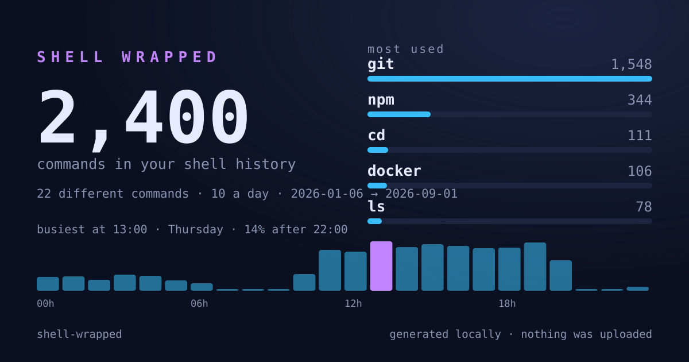
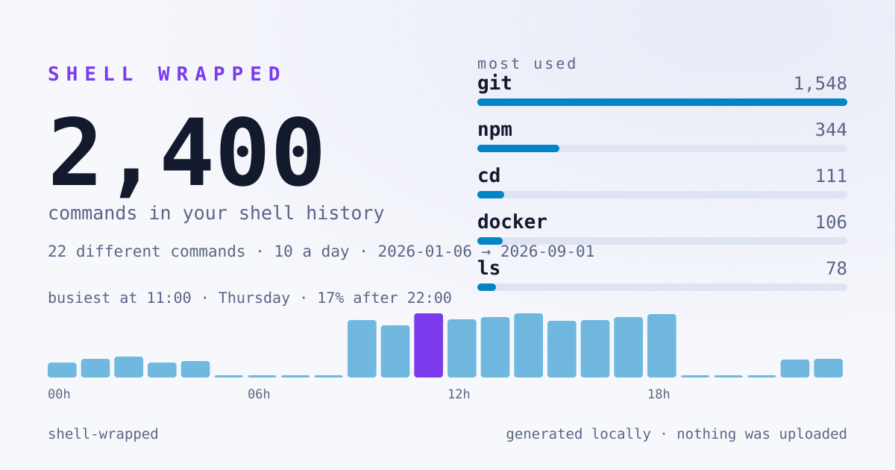

# shell-wrapped

**Spotify Wrapped, for your terminal.** It reads your shell history — the one
already on your disk — and tells you what you actually spent the year typing.
Then it hands you a card you can post.

[](https://github.com/CedricPoint/shell-wrapped/actions/workflows/ci.yml)
[](package.json)
[](package.json)
[](#your-history-stays-yours)
[](LICENSE)

```bash
npx github:CedricPoint/shell-wrapped
```



```
  shell wrapped   2,400 commands · 22 unique · 10 a day
  2026-01-06 → 2026-09-01

  your top commands

  git           1548  65%  ████████████████████████████████████████
  npm            344  14%  █████████
  cd             111   5%  ███
  docker         106   4%  ███
  ls              78   3%  ██

  you and git
  push 181  ·  checkout 171  ·  log 166  ·  stash 165  ·  status 157

  when you work
  ▃▃▃▃▃▁▁▁▁▇▇█▇██▇▇██▁▁▁▃▃
  0h                       12h                      23h
  busiest at 11:00  ·  Thursday is your day  ·  17% after 22:00
  your biggest day was 2026-02-12, with 19 commands

  habits
      49  asked nicely with sudo
      20  recursive deletions
       4  force pushes
      19  fresh starts (clear)
      38  steps backwards (cd ..)
       1  times you typed :q at a shell

  near misses
  gti → git (3)  ·  sl → ls (3)

  longest streak   22 × git in a row, without doing anything else
```

*(That is a made-up history — `npm run demo` regenerates it. Yours will be worse.)*

## Your history stays yours

This is the part worth reading twice, because a shell history is the most
sensitive text file on your machine: it is full of hostnames, tokens, and the
one time you typed a password in the wrong place.

- **Nothing is uploaded.** There is no network code in this repository. No
  telemetry, no "anonymous" stats, no update check.
- **No argument ever reaches the output.** Only the *name* of a command, the
  name of its subcommand, counts and timestamps. `curl -H "Authorization:
  Bearer sk_live_…"` is counted as one `curl` and nothing else — not in the
  terminal report, not in `--json`, not in the card. There is a test that takes
  a history full of planted secrets and fails if any of them appears anywhere
  in the output.
- **Nothing is written** unless you ask for `--svg`.

So the card is safe to post. That was the whole design constraint.

## What it reads

| shell | where | timestamps |
| --- | --- | --- |
| zsh | `~/.zsh_history` | yes, with `EXTENDED_HISTORY` |
| bash | `~/.bash_history` | only if you set `HISTTIMEFORMAT` |
| fish | `~/.local/share/fish/fish_history` | yes |
| PowerShell | `…/PSReadLine/ConsoleHost_history.txt` | no |

Every one it finds is read and merged. Without timestamps you still get the
leaderboard, the habits and the typos — just not the clock.

```bash
shell-wrapped --list            # where it looked, and what it found
```

## Usage

```bash
shell-wrapped                   # everything it can find
shell-wrapped --year 2026       # just this year
shell-wrapped --days 30         # just this month
shell-wrapped --shell fish      # just one shell
shell-wrapped --file ./history --shell zsh
shell-wrapped --svg wrapped.svg --theme light
shell-wrapped --json            # the whole report, for your own scripts
```

The card is 1200×630 — the size every social preview expects — and it is a
single self-contained SVG: no external font, no image, no request.



## The interesting part: near misses

`gti`, `nmp`, `sl`, `cd..` — the detector looks for a command you typed once or
twice that is **one keystroke** away from one you type all day, and reports the
pair.

The subtlety is that the three most common typos in the world are two letters
swapped, and plain Levenshtein scores a swap as two edits — so a naive version
of this finds nothing at all. This one counts a swap of neighbours as one
mistake, which is what it is.

## Install

```bash
npx github:CedricPoint/shell-wrapped          # nothing installed
npm install -g github:CedricPoint/shell-wrapped
```

Node 18 or newer. No dependencies, no build step, no config.

## As a library

```js
import { available, read, analyse, card } from 'shell-wrapped';

const entries = available().flatMap(read);
const report = analyse(entries);

console.log(report.busiestHour, report.top[0]);
writeFileSync('card.svg', card(report, { theme: 'light' }));
```

## Tests

34 of them: every history format, the stats, the typo detector, the card's
well-formedness, and the privacy rule above.

```bash
npm test
```

## License

MIT
